```{r setup, include=FALSE}
options(htmltools.dir.version = FALSE)

library(plotly)
library(tidyverse)
library(htmlwidgets)
```


# About me 


---
class: big, inverse, left, middle

<h1>

<ul>
<li> Quantitative genetics </li>
  <ul>
  <li> animals </li>
  <li> plants </li>
  </ul>

<br/>
<li>Big data analysis</li>

<br/>

<li>Computer vision and image analysis for image-based high-throughput phenotyping</li>
</ul>

</h1>

---
# Interactive visualization in a nutshell
Example 
[Collision Detection](https://bl.ocks.org/mbostock/raw/3231298/)


---
class: small, left, top
## Why Interactive Visualization?

Interactivity allows users to
  
* ####Focus on detail:

  * Select and Zoom into a visualization
  * Hover over to get the exact information

* ####Enhance User experience:

  * Provide a tool for viewers to explore your data
  * User can actively select areas of interest in a chart
  * Users can get a summary of the relevant data

* ####Pose multiple questions:

    * Switch axes or to add confabulating factors
    * Break down responses to a specific question

.footnote[Martin Hadley, 3 benefits of interactive visualization, https://campus.sagepub.com/blog/3-benefits-of-interactive-visualization]


---
class: small, left, top
## Why Interactive Visualization?

#### Interactivity allows users to focus on detail:

  * Select and Zoom into a visualization
  * Hover over to get the exact information

.footnote[Martin Hadley, 3 benefits of interactive visualization, https://campus.sagepub.com/blog/3-benefits-of-interactive-visualization]


---
# Scatter Plots 
<iframe src="p1.html" width="100%" height="540" id="igraph" scrolling="no" seamless="seamless" frameBorder="0"> </iframe>
[https://plot.ly/r/line-and-scatter/](https://plot.ly/r/line-and-scatter/)

---
# Scatter and Line Plots 
<iframe src="p2.html" width="100%" height="540" id="igraph" scrolling="no" seamless="seamless" frameBorder="0"> </iframe>
[https://plot.ly/r/line-and-scatter/](https://plot.ly/r/line-and-scatter/)

---
# Cumulative Lines Animation 
<iframe src="p3.html" width="100%" height="540" id="igraph" scrolling="no" seamless="seamless" frameBorder="0"> </iframe>
[https://plot.ly/r/cumulative-animations/](https://plot.ly/r/cumulative-animations/)


---
class: small, left, top
## Why Interactive Visualization?

#### Interactivity allows enhanced user experience:

  * Provide a tool for viewers to explore your data

  * User can actively select areas of interest in a chart

  * Users can get a summary of the relevant data

.footnote[Martin Hadley, 3 benefits of interactive visualization, https://campus.sagepub.com/blog/3-benefits-of-interactive-visualization]


---
# Basic Range Slider and Selector Buttons
<iframe src="p4.html" width="100%" height="540" id="igraph" scrolling="no" seamless="seamless" frameBorder="0"> </iframe>
[https://plot.ly/r/range-slider/](https://plot.ly/r/range-slider/)


---
# Mulitple Slider Controls
<iframe src="p5.html" width="100%" height="540" id="igraph" scrolling="no" seamless="seamless" frameBorder="0"> </iframe>
[https://plot.ly/r/range-slider/](https://plot.ly/r/range-slider/)


---
class: small, left, top
## Why Interactive Visualization?

#### Interactivity allows users to pose multiple questions:

* Switch axes or to add confabulating factors

* Break down responses to a specific question

.footnote[Martin Hadley, 3 benefits of interactive visualization, https://campus.sagepub.com/blog/3-benefits-of-interactive-visualization]


---
# 3D Scatter Plots
<iframe src="p3dscat.html" width="100%" height="540" id="igraph" scrolling="no" seamless="seamless" frameBorder="0"> </iframe>


---
# Grouped Box Plots
<iframe src="p6.html" width="100%" height="540" id="igraph" scrolling="no" seamless="seamless" frameBorder="0"> </iframe>
[https://plot.ly/r/box-plots/](https://plot.ly/r/box-plots/)


---
# Correlation Map
<iframe src="p7.html" width="100%" height="540" id="igraph" scrolling="no" seamless="seamless" frameBorder="0"> </iframe>
[https://plot.ly/~smysona/8/correlation-map/#/](https://plot.ly/~smysona/8/correlation-map/#/)


---
# New York Times interactive graphics
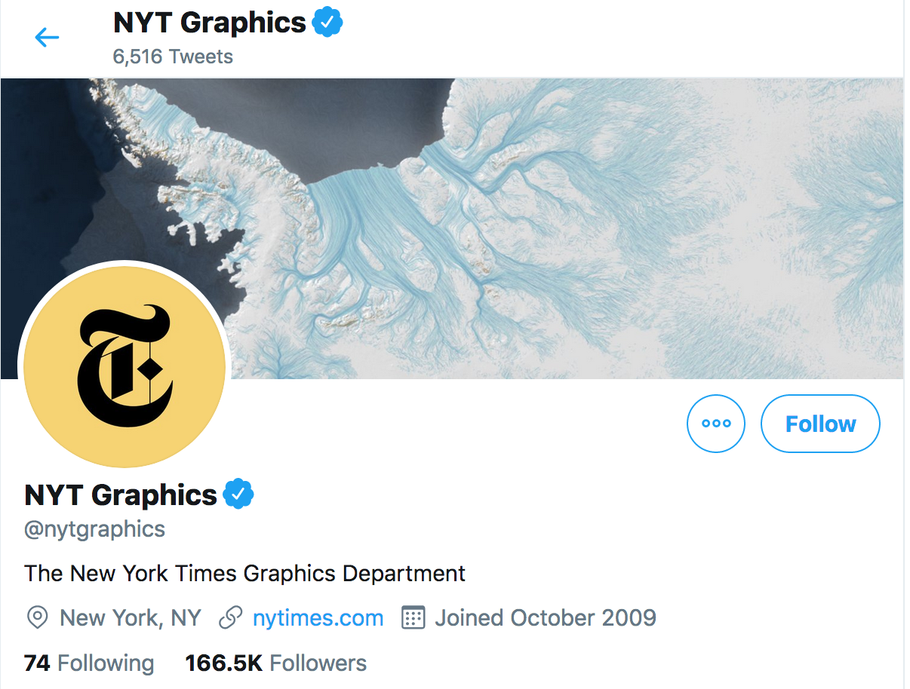

[NYT Graphics Twitter](https://twitter.com/nytgraphics?lang=en)


Some examples in agriculture and environments 

- [Disappearing shorelines](https://archive.nytimes.com/www.nytimes.com/interactive/2012/11/24/opinion/sunday/what-could-disappear.html)

- [ Drought Across the U.S.](https://www.nytimes.com/interactive/2014/upshot/mapping-the-spread-of-drought-across-the-us.html)


---
# Shiny - [https://shiny.rstudio.com/](https://shiny.rstudio.com/)

- A web application framework for **interactive** visualization in R

- Able to generate user friendly web interfaces 

- Interactively explore data

- Built on a reactive programming model

- Entirely extensible 
   - custom inputs and outputs
   - CSS themes
   - JavaScript and D3.js

- Example - [Collision Detection](https://bl.ocks.org/mbostock/raw/3231298/)

---

# Shiny framework 
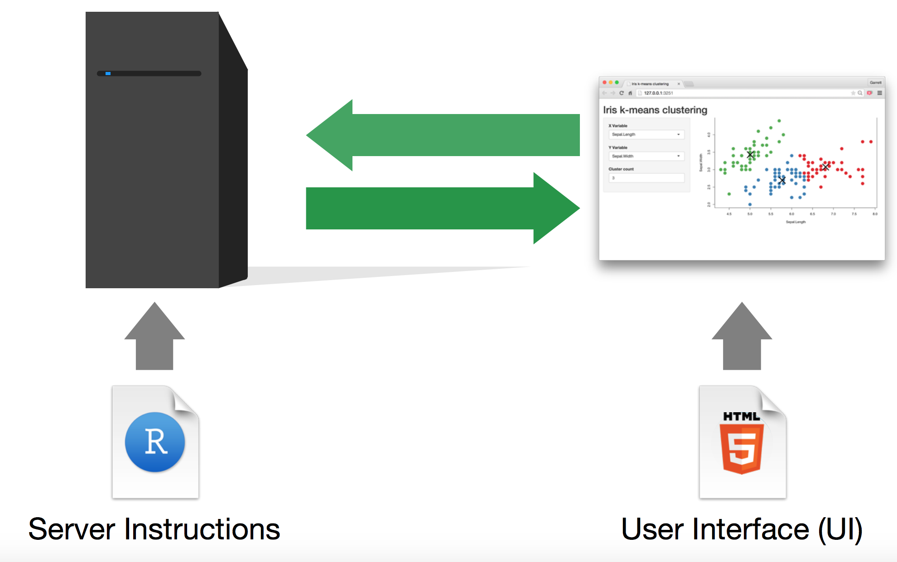


---

# Control widgets 

.left[[RStudio](https://shiny.rstudio.com/tutorial/written-tutorial/lesson3/)]


---
# Basic components of a shiny app
```{r eval=FALSE, tidy=FALSE}
library(shiny)

ui <- fluidPage(YOUR CODE)
server <- function(input, output) {YOUR CODE}

shinyApp(ui = ui, server = server)
```
The Shiny app consists of a **ui** and **server** in a single file named **app.R.**

- The ui controls the layout and style

- The server controls the behaviour

Alternatively, we can run a shiny app using the `runApp()` function 
```{r eval=FALSE, tidy=FALSE}
shiny::runApp('~/Dropbox/chikudaisei/research2/myseminar/2020/3')
```


---
# Animal data
ChickWeight data from the [datasets](https://stat.ethz.ch/R-manual/R-devel/library/datasets/html/ChickWeight.html) package. The body weights of the chicks were measured at birth and every second day thereafter until day 21. There were four groups on chicks on different protein diets.

- weight: a numeric vector giving the body weight of the chick (gm).

- Time: a numeric vector giving the number of days since birth when the measurement was made.

- Chick: an ordered factor with levels 18 < ... < 48 giving a unique identifier for the chick.

- Diet: a factor with levels 1, ..., 4 indicating which experimental diet the chick received.

```{r eval=FALSE, tidy=FALSE}
library(datasets)

head(ChickWeight)
  weight Time Chick Diet
1     42    0     1    1
2     51    2     1    1
3     59    4     1    1
4     64    6     1    1
5     76    8     1    1
6     93   10     1    1
```


---
# User interface object 1
```{r eval=FALSE, tidy=FALSE}
ui <- fluidPage(
  # App title ----
  titlePanel("ChickWeight data"),
  # Sidebar layout with input and output definitions ----
  sidebarLayout(
    # Sidebar panel for inputs ----
    sidebarPanel(
      # Input: Slider for the number of bins ----
      {{sliderInput(inputId = "bins",}}
                  {{label = "Number of bins:",}}
                  {{min = 1,}}
                  {{max = 30,}}
                  {{value = 15)}}
    ),
    # Main panel for displaying outputs ----
    mainPanel(
      # Output: Histogram ----
      {{plotOutput(outputId = "distPlot")}}
    )
  )
)
```


---
# Server function 1
```{r eval=FALSE, tidy=FALSE}
server <- function(input, output) {

  # Plot
  {{output$distPlot <- renderPlot({}}
    
    x <- ChickWeight$weight
    {{bins <- seq(min(x), max(x), length.out = input$bins + 1)}}
    hist(x, breaks = bins, col = "#75AADB", border = "white",
         xlab = "Weight",
         main = "ChickWeight data")
  })
}
```


---
class: inverse, left, middle

# Histogram for each diet type?

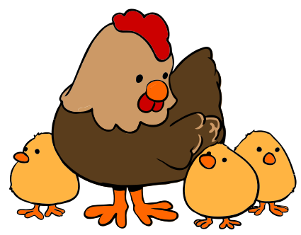
[Wikimedia Commons](https://commons.wikimedia.org/wiki/File:Hen_and_chicks_cartoon_04.svg)


---
# User interface object 2
```{r eval=FALSE, tidy=FALSE}
ui <- fluidPage(
  titlePanel("ChickWeight data"),
  sidebarLayout(
      sidebarPanel(
      sliderInput(inputId = "bins",
                  label = "Number of bins:",
                  min = 1,
                  max = 30,
                  value = 15),

      {{radioButtons("dd",}}
                   {{label = "Select Diet",}}
                   {{choices = list("ALL" = 0, "1" = 1,"2" = 2,"3" = 3,"4" = 4),}}
                   {{selected = 0)} }}

    ),
    # Main panel for displaying outputs ----
    mainPanel(
      plotOutput(outputId = "distPlot"),
      
  )
))

```


---
# Server function 2
```{r eval=FALSE, tidy=FALSE}
server <- function(input, output) {

  # Reactive dataframe
  {{ChickWeight2 <- reactive({}}
    {{a <- subset(ChickWeight, Diet == as.numeric(input$dd))}}
    {{return(a)}}
  {{}}})}}

  # Plot
  output$distPlot <- renderPlot({
    {{if (input$dd == 0){}}
      x <- ChickWeight$weight
      bins <- seq(min(x), max(x), length.out = input$bins + 1)
      hist(x, breaks = bins, col = "#75AADB", border = "white",
           xlab = "Weight",
           main = "ChickWeight data")
   {{}} } else {}}
      {{x <- ChickWeight2()$weight}}
      {{bins <- seq(min(x), max(x), length.out = input$bins + 1)}}
      {{hist(x, breaks = bins, col = "#75AADB", border = "white",}}
           {{xlab = "Weight",}}
           {{main = "ChickWeight data")}}
}})}
```


---
class: inverse, left, middle

# Demo 1


[Wikimedia Commons](https://commons.wikimedia.org/wiki/File:Hen_and_chicks_cartoon_04.svg)


---
class: inverse, left, middle

# Can we also make a plot interactive? 


[Wikimedia Commons](https://commons.wikimedia.org/wiki/File:Hen_and_chicks_cartoon_04.svg)


---
# Plotly R graphing library 
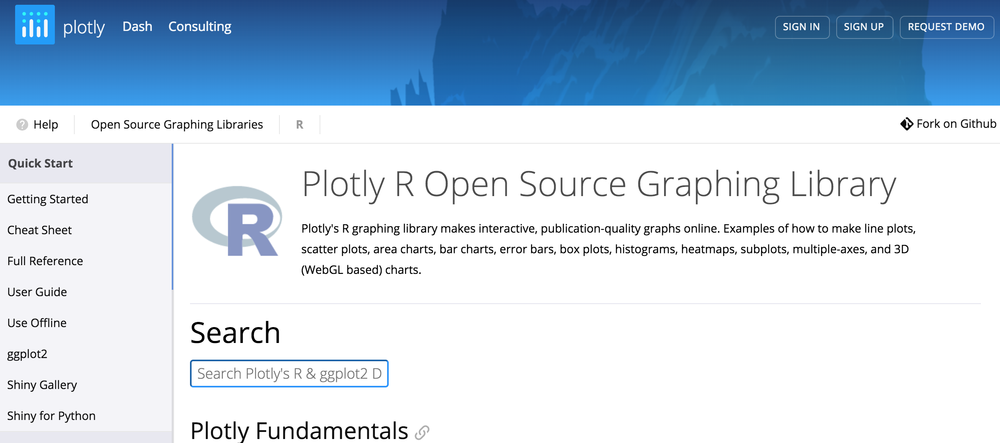
[https://plot.ly/r/](https://plot.ly/r/)


---
# User interface object 3
```{r eval=FALSE, tidy=FALSE}
ui <- fluidPage(
  titlePanel("ChickWeight data"),
  sidebarLayout(
      sidebarPanel(
      sliderInput(inputId = "bins",
                  label = "Number of bins:",
                  min = 1,
                  max = 30,
                  value = 15),

      radioButtons("dd",
                   label = "Select Diet",
                   choices = list("ALL" = 0, "1" = 1,"2" = 2,"3" = 3,"4" = 4),
                   selected = 0)} 

    ),
    # Main panel for displaying outputs ----
    mainPanel(
      {{plotOutputly(outputId = "distPlot"),}}
      
  )
))

```


---
# Server function 3
```{r eval=FALSE, tidy=FALSE}
server <- function(input, output) {

  # Reactive dataframe
  ChickWeight2 <- reactive({
    a <- subset(ChickWeight, Diet == as.numeric(input$dd))
    return(a)
  })

  # Plot
  {{output$distPlot <- renderPlotly({}}
    
    if (input$dd == 0){
      x <- ChickWeight$weight
      {{plot_ly(x = ~x, nbinsx = input$bins + 1, type = "histogram")}}
    } else {
      x <- ChickWeight2()$weight
      {{plot_ly(x = ~x, nbinsx = input$bins + 1, type = "histogram")}}
    }
  })
}
```


---
class: inverse, left, middle

# Demo 2


[Wikimedia Commons](https://commons.wikimedia.org/wiki/File:Hen_and_chicks_cartoon_04.svg)


---
# Shiny vs. Plotly

- Shiny: Interactive web applications 

- Plotly: Interactive plots

- Shiny and Plotly:  Interactive web applications and plots 


.pull-left[


]


.pull-right[


]


---
# Reactive programming 
What makes shiny apps interactive is **reactivity**.

Standard R programming 
```{r eval=FALSE, tidy=FALSE}
x <- 5
y <- x + 1
x <- 10
```


Reactive R programming 
```{r eval=FALSE, tidy=FALSE}
r <- reactiveValues()
r$x <- 5
y <- reactive(r$x + 1)
r$x <- 10
```


Credit: [Mitchell O'Hara‑Wild](https://workshop.nectric.com.au/intermediate-shiny/slides/reactive/#1)


---
# Shiny cheatsheet  

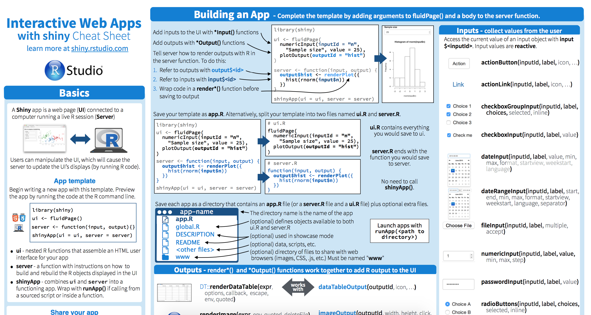

[https://shiny.rstudio.com/images/shiny-cheatsheet.pdf](https://shiny.rstudio.com/images/shiny-cheatsheet.pdf)


---
# Are you a Python user? No problem! 
Dash: Python framework for building web applications

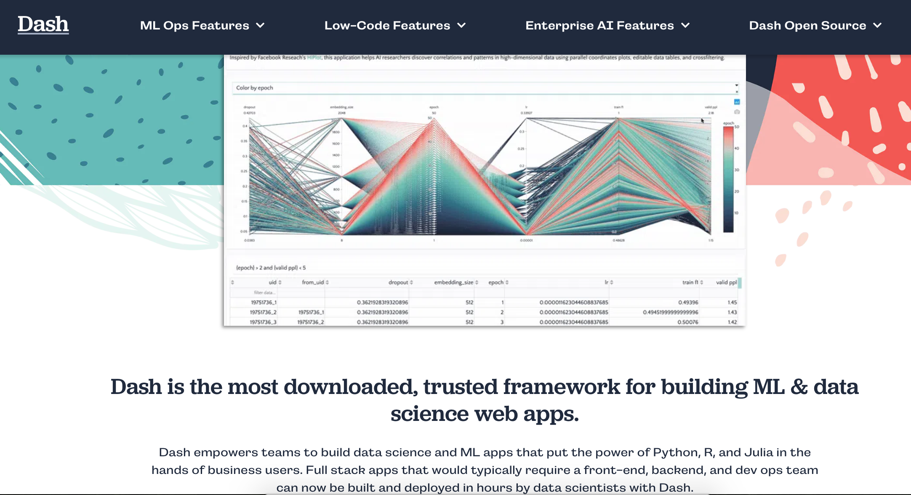

[https://plotly.com/dash/](https://plotly.com/dash/)


---
# Static Manhattan plot

.right[[Wikimedia Commons](https://commons.wikimedia.org/wiki/File:Manhattan_Plot.png)]


---
class: inverse, left, middle

# ShinyAIM - Shiny‐based application of interactive Manhattan plots

Can be used for 

- can explore GWAS peaks _interactively_

- _interactive_ exploration of Manhattan plots for longitudinal genome‐wide association studies (GWAS)

- no knowlege of R, HTML, JavaScript, or CSS is required. R code encapsulated as a web-based Shiny application


Available at [https://chikudaisei.shinyapps.io/shinyaim/](https://chikudaisei.shinyapps.io/shinyaim/) and [https://github.com/whussain2/ShinyAIM](https://github.com/whussain2/ShinyAIM)


---
# ShinyAIM Paper
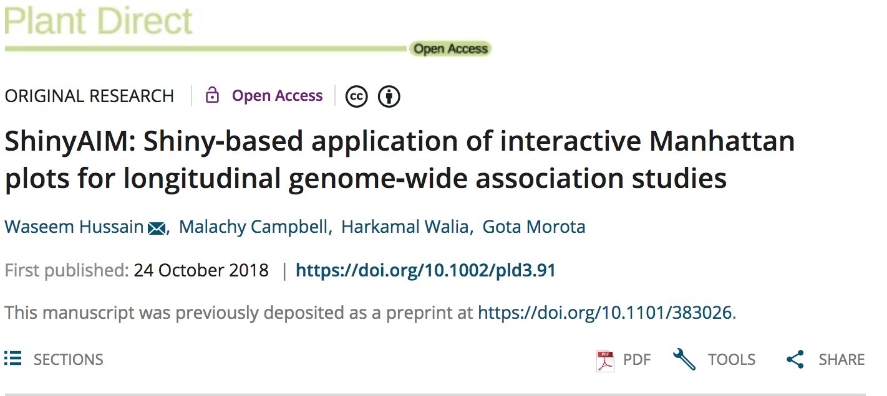

[https://doi.org/10.1002/pld3.91](https://doi.org/10.1002/pld3.91)


---
# Deterministic genomic prediction formulas

-  highlight the relationships among prediction accuracy and potential factors influencing prediction accuracy

- no computationally intensive cross-validation


1)  **Population parameter-based deterministic formulas**

- genotypes of individuals are not required 

2)  **Relationship-based deterministic formulas**

- genotypes of individuals need to be known


---
class: inverse, left, middle

# ShinyGPAS - Shiny Genomic Prediction Accuracy Simulator

Can be used for 
- _interactive_ exploration of potential factors influencing prediction accuracy 

- simulation of achievable prediction accuracy 
   - prior to genotyping individuals or performing CV
   
- supporting in-class teaching

- no knowlege of R, HTML, JavaScript, or CSS is required. R code encapsulated as a web-based Shiny application


Available at [https://chikudaisei.shinyapps.io/shinygpas/](https://chikudaisei.shinyapps.io/shinygpas/) and [https://github.com/morota/ShinyGPAS](https://github.com/morota/ShinyGPAS)


---

# ShinyGPAS Paper
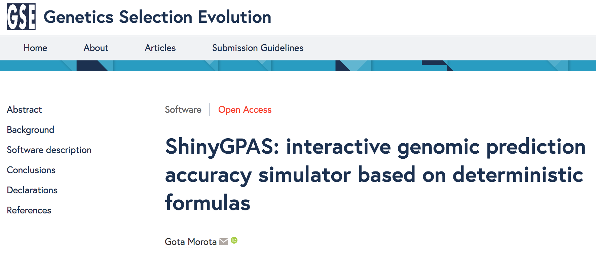

[doi:10.1186/s12711-017-0368-4](https://doi.org/10.1186/s12711-017-0368-4)


---
# Image-based high-throughput phenotyping in plants
.pull-left[
<div align="left">
<iframe src="https://innovate.unl.edu/video/leasing-options/greenhouse-innovation-center.mp4" width="250" height="150" frameBorder="0" class="giphy-embed" allowFullScreen></iframe><p><a href="https://innovate.unl.edu/greenhouse-innovation-center">UNL Greenhouse Innovation Center</a>
</p>
</div>

<div align="left">
<iframe width="260" height="200" src="https://www.youtube.com/embed/wor4BFjbIyI?rel=0" frameborder="0" allow="autoplay; encrypted-media" allowfullscreen></iframe>
<p><a href="https://www.youtube.com/watch?v=wor4BFjbIyI">Spidercam</a>
</div>

]

.pull-right[
<div align="right">
<p>Unmanned aerial vehicle<a href="https://www.frontiersin.org/articles/10.3389/fpls.2017.00421/full"> (Watanabe et al. 2017)</a>
</div>
]


---
# Image-based high-throughput phenotyping in animals 
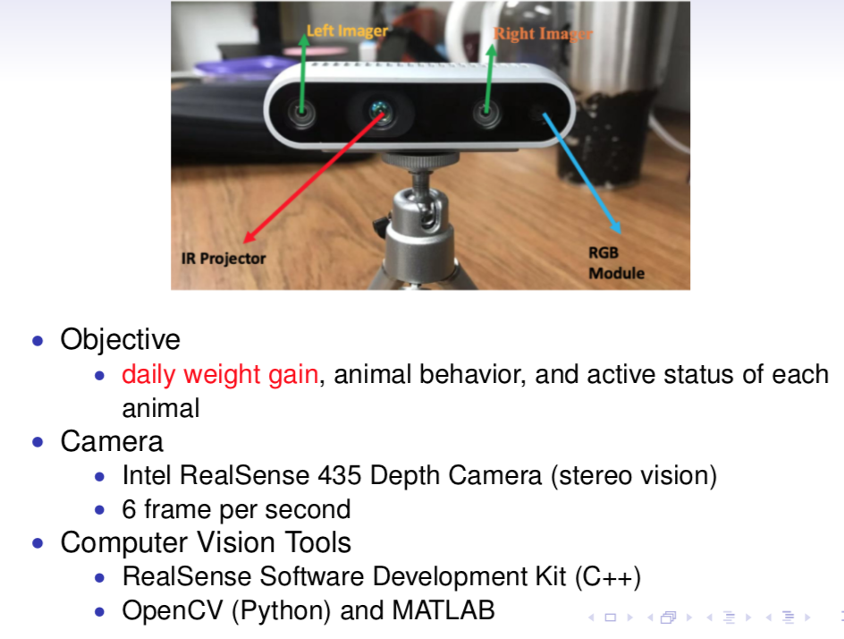


---
# Cows
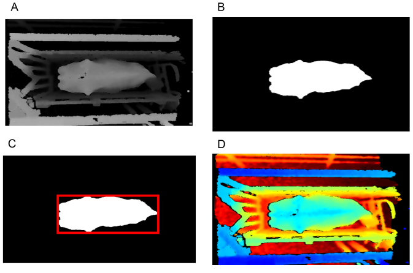

A: HSV image. B: Segmented image.	C: The identified cow with a bounding box. D: Depth image.	


---
# Pigs
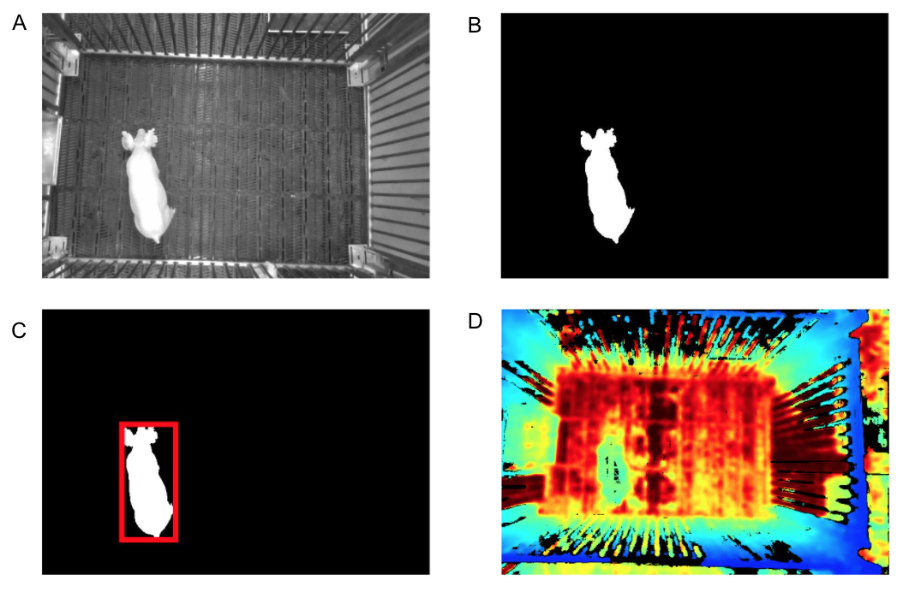

A: RGB image converted to grayscale. B: Segmented image. C: The identified pig with a bounding box. D. Depth image.


---
# Shiny Cow
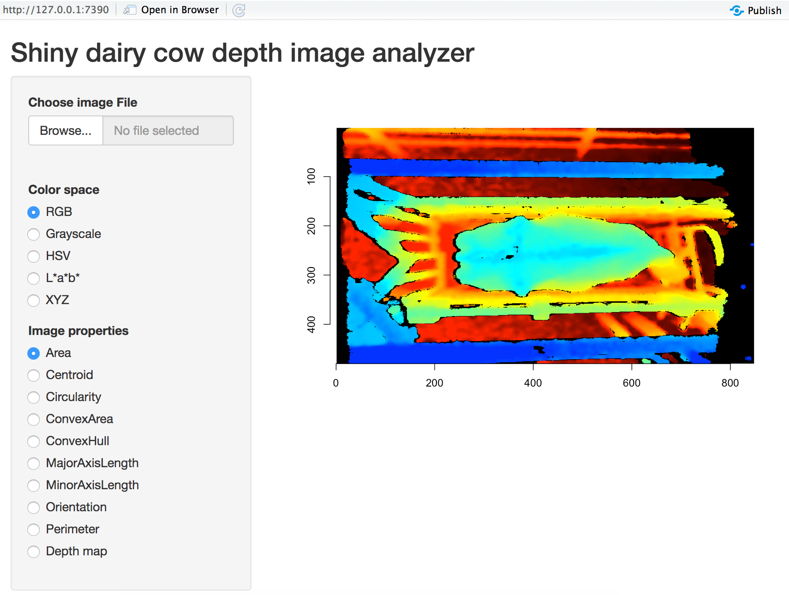

Under development 


---
# Summary

- data visualization plays a crucial role in summarizing and identifying the characteristics of data

- however, big data prevent the plotting of the entire picture 

- interactive visualization, with capabilities to zoom in and out, can help investigate both global and local structures of graphs


---
# Useful materials  


- [Mastering Shiny](https://mastering-shiny.org/)


- [Interactive documents with Shiny](https://workshop.nectric.com.au/intermediate-shiny/)


